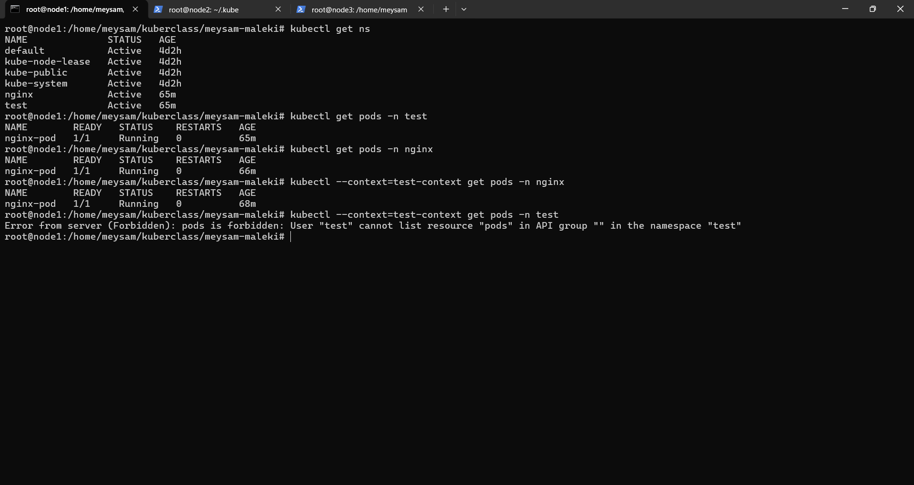

# 🔐 Kubernetes RBAC Cross-Namespace Access Task

> Demonstrating fine-grained Role-Based Access Control (RBAC) between namespaces and external users in Kubernetes.

---

## 📌 Project Summary

This project demonstrates advanced Kubernetes RBAC configuration including:

- Multi-namespace architecture (`test`, `nginx`)
- Cross-namespace Pod read permissions using `Role` and `RoleBinding`
- ServiceAccount-based access simulation
- External user certificate authentication
- Namespace-scoped access restriction

The goal is to showcase practical RBAC design and verification techniques in a real Kubernetes cluster.

---

## 🏗 Architecture Overview

### Namespaces
- `test`
- `nginx`

### Workloads
- One `nginx` Pod deployed in each namespace

### Access Design

| Actor | Target Namespace | Permissions |
|-------|------------------|------------|
| test default ServiceAccount | nginx | get, list Pods |
| nginx default ServiceAccount | test | get, list Pods |
| External user `test` | nginx | get, list Pods |
| External user `test` | test | ❌ Denied |

---

## 📂 Repository Structure
```
├── namespaces.yaml
├── pods.yaml
├── rbac-cross-namespace.yaml
├── user-rbac.yaml
├── test.crt
├── test.csr
├── test.key
├── README.md
└── screenshot
      └── successful_run.png
```

---

# ⚙️ Implementation Details

---

## 1️⃣ Namespaces

```yaml
apiVersion: v1
kind: Namespace
metadata:
  name: test
---
apiVersion: v1
kind: Namespace
metadata:
  name: nginx
```

## 2️⃣ Pods Deployment
Each namespace runs a simple nginx Pod

```yaml
apiVersion: v1
kind: Pod
metadata:
  name: nginx-pod
  namespace: test
spec:
  containers:
  - name: nginx
    image: nginx
---
apiVersion: v1
kind: Pod
metadata:
  name: nginx-pod
  namespace: nginx
spec:
  containers:
  - name: nginx
    image: nginx
```
## 3️⃣ Cross-Namespace RBAC Configuration
Role: Allow Pod Read Access

```yaml
apiVersion: rbac.authorization.k8s.io/v1
kind: Role
metadata:
  name: pod-reader
  namespace: test
rules:
- apiGroups: [""]
  resources: ["pods"]
  verbs: ["get", "list"]
---
apiVersion: rbac.authorization.k8s.io/v1
kind: Role
metadata:
  name: pod-reader
  namespace: nginx
rules:
- apiGroups: [""]
  resources: ["pods"]
  verbs: ["get", "list"]
```
RoleBinding: Cross-Namespace ServiceAccount Access
```yaml
apiVersion: rbac.authorization.k8s.io/v1
kind: RoleBinding
metadata:
  name: pod-reader-binding
  namespace: test
subjects:
- kind: ServiceAccount
  name: default
  namespace: nginx
roleRef:
  kind: Role
  name: pod-reader
  apiGroup: rbac.authorization.k8s.io
---
apiVersion: rbac.authorization.k8s.io/v1
kind: RoleBinding
metadata:
  name: pod-reader-binding
  namespace: nginx
subjects:
- kind: ServiceAccount
  name: default
  namespace: test
roleRef:
  kind: Role
  name: pod-reader
  apiGroup: rbac.authorization.k8s.io
```
## 4️⃣ External User Access Restriction

External user test is restricted to nginx namespace only.

Role
```yaml
apiVersion: rbac.authorization.k8s.io/v1
kind: Role
metadata:
  name: nginx-pod-access
  namespace: nginx
rules:
- apiGroups: [""]
  resources: ["pods"]
  verbs: ["get", "list"]
```
RoleBinding

```yaml
apiVersion: rbac.authorization.k8s.io/v1
kind: RoleBinding
metadata:
  name: nginx-pod-access-binding
  namespace: nginx
subjects:
- kind: User
  name: test
  apiGroup: rbac.authorization.k8s.io
roleRef:
  kind: Role
  name: nginx-pod-access
  apiGroup: rbac.authorization.k8s.io
```
---

# 👤 External User Certificate Setup

---
## 1️⃣ Generate Private Key and CSR

```bash
openssl genrsa -out test.key 2048
openssl req -new -key test.key -out test.csr -subj "/CN=test/O=nginx"
```
## 2️⃣ Sign CSR with Kubernetes CA

```bash
sudo openssl x509 -req \
  -in test.csr \
  -CA /etc/kubernetes/pki/ca.crt \
  -CAkey /etc/kubernetes/pki/ca.key \
  -CAcreateserial \
  -out test.crt \
  -days 365
```

## 3️⃣ Configure kubeconfig Context

```bash
kubectl config set-credentials test \
  --client-certificate=test.crt \
  --client-key=test.key

kubectl config set-context test-context \
  --cluster=kubernetes \
  --namespace=nginx \
  --user=test
```

---

# 🚀 Deployment & Testing

---

## Apply Resources

```bash
kubectl apply -f namespaces.yaml
kubectl apply -f pods.yaml
kubectl apply -f rbac-cross-namespace.yaml
kubectl apply -f user-rbac.yaml
```

## Validate Cross-Namespace Access
ServiceAccount Simulation

```bash
kubectl auth can-i get pods -n nginx --as=system:serviceaccount:test:default
kubectl auth can-i list pods -n nginx --as=system:serviceaccount:test:default

kubectl auth can-i get pods -n test --as=system:serviceaccount:nginx:default
kubectl auth can-i list pods -n test --as=system:serviceaccount:nginx:default
```

## Validate External User Restrictions
```bash
kubectl --context=test-context get pods -n nginx
```
Expected: ✅ Success

```bash
kubectl --context=test-context get pods -n test
```
Expected: ❌ Forbidden

---

# Successful Run Screenshot

